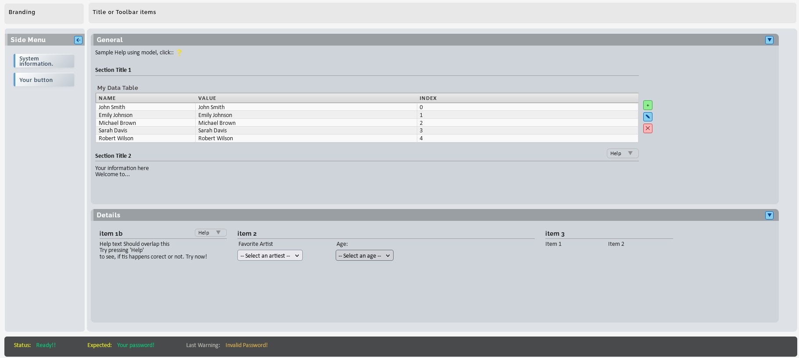

<a id="Setup"></a>

## Setup

Follow these steps to set up your .NET 8.0 development container.

<a id="Create-Start .NET container"></a>

### Create and Start the .NET Container

**Navigate to the service directory:**

Open PowerShell and navigate to the <span class="nje-cmd-inline-sm">.\NET-Core-8\Net8-Service</span> directory, then follow these steps:  
**🔹Tip**: Rename the `Net8-Service` to a name that identifies **`your project`** to more easily identify it in Docker (Name). For this document we continue to use the name `Net8-Service`

**1. Create the external network**

   Because this service uses an **external network**, you must ensure the network is created **before** creating the container. The network configuration is defined in the `.env` file. Create the network with this command:
   <pre class="nje-cmd-multi-line-sm" style="margin-top:-20px;"> docker network create --subnet=172.40.0.0/24 dev1-net
 # This subnet is defined in `.env`</pre>
   <div class="nje-br2"> </div>
   <span class="nje-colored-block" style="--nje-bgcolor:gray; --nje-textcolor:white; ">
   If you get an error message that the network already exists, you're probably good to go!
   </span>

Open a the `.env` and define a project **IP** address, that will be used in the ``compose_netcore_cont.yml`` file below

**2. Create the container**

First edit  the above defined,  **IP** address in the ``compose_netcore_cont.yml`` file then:
   <pre class="nje-cmd-multi-line-sm" style="margin-top:-20px;">
 docker-compose -f compose_netcore_cont.yml up -d
 docker-compose -f compose_netcore_cont.yml up -d --build --force-recreate
   </pre>
   <span class="nje-expect-block"> After that, you should have a Docker Desktop container called: <span class="nje-cmd-inline-sm">net8-service-net-core8-img-1</span> </span>

**3. To start a CLI in this container:**

   <pre class="nje-cmd-one-line-sm-indent1" style="margin-top:-20px;"> docker exec -it net8-service-net-core8-img-1 bash </pre>
   <span class="nje-expect-block"> This should open the Docker Container in the directory: <span class="nje-cmd-inline-sm">/hostmount/workspace</span></span>

<div class="nje-br2"> </div>
<a id="Troubleshooting"></a>

#### Troubleshooting: Container is Not Starting

If the container fails to start or exits unexpectedly, check the logs:

<pre class="nje-cmd-multi-line-sm" style="margin-top:-20px;">
# Get ID of container
docker ps           # Only returns running containers!
docker ps -a        # Includes stopped containers! (-a => all)
docker logs [ID]    # See what's going on
</pre>

<div class="nje-br2"> </div>

#### Verify .NET Installation

To verify the .NET SDK is installed correctly:  

<pre class="nje-cmd-one-line-sm-indent1" style="margin-top:-20px;">
docker exec -it net8-service-net-core8-img-1 bash
</pre>

Then inside the container:
<pre class="nje-cmd-multi-line-sm" style="margin-top:-20px;">
dotnet --list-sdks
dotnet --list-runtimes
</pre>
<div class="nje-br2"> </div>

---

<a id="Using Scripts to create Template Apps"></a>

### Creating Template Applications with the Scripts

Assuming that the Docker container has been successfully created and can be started with:<span class="nje-cmd-inline-sm">  docker exec -it net8-service-net-core8-img-1 bash</span> we will show here how you can create a .NET 8.0 Template application with the different scripts that are provided within setup. In general there are three methods that will be described below:

1. Using CookieCutter (easiest)
2. Using  Alternative Scripts
3. Old School .NET.

#### 1. Use the Cookiecutter Scripts <span style="color: #0dbf60ff; font-size: 0.8em; "> (Recommended if available) </span>

This container includes the following **ready-to-use Cookiecutter scripts** for creating different types of .NET 8 applications with an advanced template, in contrast to the non-Cookiecutter scripts in the next section, these scripts should be started on the Windows host and can be found in the folder: ***./project/workspace/.vscode-templates/[application type]/cookiecutter-dotnet-****. for example: 
  ` ./project/workspace/.vscode-templates/mvc/cookiecutter-dotnet-mvc/`

That folder contains a  `README.md` file with a few requirements and instruction to execute the script. But when you have installed Python and the Cookiecutter module it is as simple as executing the script: **`Create-mvc.ps1`** with the Windows Power-Shell program After that, the solution and the newly created project will be created one folder up.

##### Available Cookiecutter Script(s)

|**Cookiecutter Script** | **Creates** | **Use For** |
|:--------|:---------|:---------|
| `vscode-templates\mvc\cookiecutter-dotnet-mvc\\create_mvc.sh` | MVC Web Application with advanced  template | *See also side note: 'Create Applications with Cookiecutter template*' in previous section  |


#### 2. Use the Alternative Script()

This container includes a **number of ready-to-use script templates** for creating different types of .NET 8 applications. When you start the docker CLI container, you will automatically enter the **host mount workspace** (<span class="nje-cmd-inline-sm">/hostmount/workspace</span>) in your **Bash Shell**, if not, <span class="nje-cmd-inline-sm">cd</span> to that directory.

**To access the scripts:**  
Execute these commands:  

<pre class="nje-cmd-multi-line-sm" style="margin-top:-20px;">
cd scripts                   # Navigate to script templates
ls -la                       # List all available scripts
</pre>
<span class="nje-expect-block"> The scripts will create the applications in directory: **/hostmount/workspace** </span>

##### Available Script Templates

|**Script** | **Creates** | **Use For** |
|:--------|:---------|:---------|
| `create_console.sh` | Console Application | CLI tools, utilities, learning |
| `create_webapi.sh` | REST API Service | Backend services, microservices |
| `create_webapiaot.sh` | High-Performance API | Ultra-fast APIs, cloud-native |
| `create_mvc.sh` | MVC Web Application | Traditional websites, admin panels |
| `create_mvc.sh` | MVC Web Application | Traditional websites, admin panels |
| `create_webapp.sh` | Razor Pages App | Content-heavy sites, blogs |
| `create_blazorserver.sh` | Blazor Server App | Interactive web apps (server-side) |
| `create_blazorwasm.sh` | Blazor WebAssembly | Client-side web apps (browser) |
| `create_grpc.sh` | gRPC Service | High-performance service communication |
| `create_worker.sh` | Background Service |long-running tasks, optional scheduled tasks (needs library) |
| `create_classlib.sh` | Class Library (DLL) | Reusable code, NuGet packages |
| `create_xunit.sh` | Unit Test Project | Testing your applications |

##### Example: Scripts command

**Basic Usage:**

<pre class="nje-cmd-multi-line-sm" style="margin-top:-20px;">
cd scripts
./create_console.sh                    # Creates 'app-console' in workspace
./create_webapi.sh my-api              # Creates 'my-api' in workspace  
./create_mvc.sh my-site /custom/path   # Creates 'my-site' in custom location
</pre>
<div class="nje-br2"> </div>
<div class="nje-text-block" style="background-color:gray; color:yellow">

**Script Parameters:**

- **First parameter**: Application name (optional, uses default if omitted)
- **Second parameter**: Target directory (optional, defaults to:  <span class="nje-cmd-inline-sm">/hostmount/workspace</span>)

</div>

#### 3. Creating using old school method: .NET

If your preferred .NET template isn't scripted, use the official .NET CLI in the **Bash shell**

**ASP.NET Core Example:**  
For example to create an ASP.NET Core program (manually) in Docker, follow these steps:

<div class="nje-indent1" style="margin-bottom:-30px;">
  <span class="nje-colored-block" > Note: The resulting application will be created in the host mount folder: **/hostmount/workspace** </span>
</div>

- Create the app <br>
  <pre class="nje-cmd-inline-sm">
  dotnet new web -n MyAspNetApp
  </pre>

- Get the NuGet packages required
  <pre class="nje-cmd-multi-line-sm">
  cd MyAspNetApp
  dotnet restore
  </pre>

- Run the app
  <pre class="nje-cmd-multi-line-sm">
  # Start the application server
  dotnet run --urls "http://0.0.0.0:5000" &
  </pre>

- Access the app on the host
  Because we specified 0.0.0.0 as the listening IP address in the previous command, we can reach the web page on the host via localhost! Open a browser and navigate to: <span class="nje-cmd-inline-sm"> http://localhost:5000/</span>

---

<a id="Using Scripts to create Sample Apps"></a>

### Run\test  the created App in the Docker terminal

To run a Web based app:

  <pre class="nje-cmd-multi-line-sm" style="margin-top:-20px;">
  cd /hostmount/workspace/your-app  
  # for example
  cd /hostmount/workspace/app-mvc

  # Then run it:
  dotnet run --urls "http://0.0.0.0:5000" &
  </pre>


<div class="nje-br3"> </div>
<details class="nje-back-box">
  <summary>Why Applications are Created in Host Workspace
  </summary>

### Why Applications are Created in Host Workspace

By default, all applications are created in <span class="nje-cmd-inline-sm">/hostmount/workspace</span> because:

- ✅ **Accessible from both Windows host and container**
- ✅ **Persistent** - survives container restarts
- ✅ **Easy editing** - use Windows tools (VS Code, Visual Studio)
- ✅ **Source control** - git repositories work seamlessly

### Performance

Note: For CPU-intensive builds, you can copy projects to the container:

<span class="nje-cmd-inline-sm"> cp -r ./my-app /cworkspace/ </span>

<p align="center" style="padding:20px;">─── ✦ ───</p>
</details>
<div class="nje-br4"> </div>


<div class="nje-br3"> </div>
<details class="nje-back-box">
  <summary>Create Applications with Cookiecutter template <span style="color: #0dbf60ff; font-size: 1.0em; "> (Recommended) </span>
  </summary>

### Using Cookiecutter

Currently, there is one template available that creates an MVC application using **Cookiecutter**. his template provides a complete MVC application GUI. The application is created in the shared Windows Workspace folder, not inside the bash container.

***To Install:***

- Enter the folder: **.\workspace\.vscode-templates\mvc\cookiecutter-dotnet-mvc\\**
- Read the ***README.md*** file 
  - Essentially, you just need to ensure **Python** and **Cookiecutter** are installed, then execute the PowerShell script.<br><br>
  
  An example of the MVC application is displayed below:

<a href="Sample-mvc.png.jpg" target="_blank">
  
</a><br><br>

More Cookiecutter templates are planned for the future. The documentation will be updated accordingly to ensure consistency.

<p align="center" style="padding:20px;">─── ✦ ───</p>
</details>
<div class="nje-br4"> </div>

<a id="Creating Applications with .NET"></a>


<div class="nje-br2"> </div>
<details class="nje-note-box">
  <summary>Getting Container IP Address
  </summary>
If you need the IP address of the container to access the page via the host:
- Get the name or ID of the container: <span class="nje-cmd-inline-sm">docker ps</span>
- Execute this to get the IP:
  <div class="nje-br2"> </div>
  <pre class="nje-cmd-multi-line-sm">docker inspect -f '{{range .NetworkSettings.Networks}}{{.IPAddress}}{{end}}' [container_id_or_name]
  # For this specific container:
  docker inspect -f '{{range .NetworkSettings.Networks}}{{.IPAddress}}{{end}}' net8-service-net-core8-img-1
  
  </pre>

Use the found IP to access the web page on the host. Start your browser on the **host** and navigate to: <span class="nje-cmd-inline-sm">http://[found_IP]:5000</span>

</details>
<div class="nje-br4"> </div>
<div class="nje-br2"> </div>

---

<a id="Use in VS Code"></a>

## Use Template Projects with Visual Studio Code

This guide shows how to use Visual Studio Code to develop, build, and debug your .NET applications. Note that you'll need to configure VS Code settings for each application you create.

**We support two build methods:**

1. **🐳 Docker Container Method** <span style="color: #0dbf60ff; font-size: 1.0em; ">(Recommended) </span> - Build and run inside the container
2. **🪟 Windows Host Method** - Build and run on your local Windows machine.  
 ***Note*** *: For some .Net application types (i.e. WPF) your are required to use this method!*

<div class="nje-br2"> </div>

<div class="nje-indent2">
  <div class="nje-text-block" style="background-color:#757575; color:#F5F5F5">

  **💡 Our Recommendation:**  
  
  - Use **Method 1 (Docker Container)** for the most consistent, production-like environment. The Docker container was specifically designed for containerized .NET development and ensures your builds match the deployment environment.
  - **When to use Method 2:** Choose the Windows Host method if you need faster IntelliSense, prefer native Windows debugging, or want to avoid Docker overhead during rapid development cycles.

  </div>
  **Important:** Both methods share the same source code(on Windows):

  - **Windows:** <span class="nje-cmd-inline-sm">./workspace/your-app</span>
  - **Container:** <span class="nje-cmd-inline-sm">/hostmount/workspace</span>

</div>

---

<a id="Configure VS Code"></a>

### Configure Visual Code

This section describes how to configure Visual Studio Code running on the host to build and debug your application in Docker or Windows by setting up the VS Code ***Task.json*** and ***Launch.json*** items.

#### Prerequisites

- For Docker\Linux <span style="color: #0dbf60ff; font-size: 1.0em; ">(Recommended)</span>
  - Docker container is running (<span class="nje-cmd-inline-sm">net8-service-net-core8-img-1</span>)
  - VS Code installed on Windows
  - Application created in <span class="nje-cmd-inline-sm">/hostmount/workspace</span> (see [Creating Applications](#Using Scripts to create Sample Apps))
- For Windows:
  - .NET 8.0 SDK installed on Windows ([Download here](https://dotnet.microsoft.com/download/dotnet/8.0))
  - VS Code installed on Windows
  - You have created an application, using one of the script commands, and created it in: <span class="nje-cmd-inline-sm">.\workspace\your-app</span>

#### Setup Tasks and Launch Configuration (skip for Cookiecutter templates)

If your application was **not** created using a **Cookiecutter** template script, follow these steps to configure VS Code tasks and launch settings for Docker (Linux) and Windows. (If you used a Cookiecutter template, these steps are not needed, the required configuration files are generated automatically)

<span class="nje-colored-block" style="--nje-bgcolor: #e03f05ff; --nje-textcolor: white; margin-left:3px;">⚠️ Important: Complete this six-step configuration for each application you create without a Cookiecutter template. Most scripts will copy the files for you, but you are still required to check the files and their content.</span>
<br>


**1. Check if the `.vscode` folder in your project exists**  
Navigate to your application directory on Windows and create the configuration folder if needed:

<pre class="nje-cmd-multi-line-sm-indent1" style="margin-top:-20px;">
cd .\workspace\your-app\.vscode  # Should exist
</pre>
<div class="nje-br2"> </div>

**2. Check if the  template `.\vscode\tasks.json` exists**  
If it does not exists a Template can be found at  `.\workspace\.vscode-templates\tasks.json`.

**3. Replace `your-app` with your actual application name in all paths in the `tasks.json` file.**

**4. Check if  the  `.vscode\launch.json` exists**  
If it does not exists a template can be found at  `.\workspace\.vscode-templates\launch_[app-type].json`.

**5. Replace `your-app` with your actual application name in all paths in the copied `./vscode/launch.json` file.**

**6. Check if the `.\Directory.Build.prop` exists**  
If it does not exists a template can be found at  `.\workspace\.vscode-templates\`.  
This avoids **'Duplicated errors messages'** when building for Docker and switch to Windows builds.

7. Optional. Use **Scaffold tool** to generate CRUD items
There is a Task in VS Code 'Scaffold CRUD: Controller + Views (no DB)' this enable the genaration of CRUD Views. These additional steps are required if you want to use that.
    - Copy the **Data** directory in: ***.\workspace\.src_extra_CRUD\Data*** to **your root project.** directory.
   - Add these references to you project file and make sure to **rebuild**
      ```
      <PackageReference Include="Microsoft.EntityFrameworkCore.SqlServer" Version="8.0.0" />
      <PackageReference Include="Microsoft.EntityFrameworkCore.Tools" Version="8.0.0" />
      <PackageReference Include="Microsoft.EntityFrameworkCore.InMemory" Version="8.0.0" />
      ```
<div class="nje-br1"> </div>

---

<a id="VS Code Build"></a>

### Use the VS Code Build & Debug (Docker & Windows)

When you have set up the ***Task*** and ***Launch*** configuration in the previous section, you can build and/or debug your application. In the Docker or Windows environment, use one of the ***Task*** or ***Launch*** profiles defined in the table below.
Our <span style="color: #0dbf60ff; font-size: 1.0em;"> recommended </span> build method uses the Docker container SDK and tools.

<span class="nje-colored-block" style="--nje-bgcolor: #b78f93ff;; --nje-textcolor: white;margin-top:5px;font-size: 1em; margin-bottom:-25px ">Open Project in VS Code</span>  

1. To develop and build in the Docker container <span style="color: #0dbf60ff; font-size: 1.0em;"> recommended </span>
   - Open VS Code.
   - CTRL-SHIFT-P
   - Type: **Dev Containers:Attach to running container..**
     - Select our container: **net8-service-net-core8-img-1**
     - Use the VS Code **File → Open Folder** command to open the container folder: ***/hostmount/workspace/your-app*** (e.g., ***/hostmount/workspace/app-mvc***)

1. To develop and build within Windows:
   - Open VS Code.
   - Open the Windows folder: ***.\workspace\your-app*** (e.g., ***.\workspace\app-mvc***)
   - Installl at least these two extensions (For others see remark section, below):
     - ***ms-dotnettools.csharp***
     -***ms-dotnettools.csdevkit***

1. For both methods
    - Make sure the **required** VS Code extensions are installed in the container (see ***remark*** section  below )
    - Use the Docker\Windows Task and Launchers defined in the table in combination with these instructions

<div class="nje-indent2">
<div class="nje-br2"> </div>

  <span class="nje-colored-block" style="--nje-bgcolor: #b78f93ff;; --nje-textcolor: white;margin-top:4px;font-size: 1em;"> To Build (Ctrl+Shift+B) </span>  
    <span class="nje-indent1">  **Terminal** → **Run Build Task...** → Select [**your build task**] </span>

  <span class="nje-colored-block" style="--nje-bgcolor: #b78f93ff;; --nje-textcolor: white;margin-top:4px;font-size: 1em;"> To Debug (F5) </span>  
    <span class="nje-indent1"> **Run** → **Start Debugging** </span>

  <span class="nje-colored-block" style="--nje-bgcolor: #b78f93ff;; --nje-textcolor: white;margin-top:4px;font-size: 1em;"> To Watch </span>  
    <span class="nje-indent1"> **Terminal** → **Run Task...** → Select [**your watch task**] </span>
</div>


<div class="nje-br2"> </div>

<div class="nje-table-vct">
  <span class="nje-header-row">
    <span class="nje-hcol1">Task name</span>
    <span class="nje-hcol2">Description</span>
    <span class="nje-hcol3">Remark</span>
  </span>
  <span class="nje-row">
    <span class="nje-column1">Build (Docker)</span>
    <span class="nje-column2">Build your app using the Docker .NET SDK</span>
    <span class="nje-column3"></span>
  </span>
  <span class="nje-row">
    <span class="nje-column1">Publish (Docker)</span>
    <span class="nje-column2">Publish your app via Docker build</span>
    <span class="nje-column3"></span>
  </span>
  <span class="nje-row">
    <span class="nje-column1">Watch (Docker)</span>
    <span class="nje-column2"></span>
    <span class="nje-column3">Automatically rebuilds on file changes</span>
  </span>
  <span class="nje-row">
    <span class="nje-column1">Build (Windows)</span>
    <span class="nje-column2">Build your app using the Windows .NET SDK</span>
    <span class="nje-column3"></span>
  </span>
  <span class="nje-row">
    <span class="nje-column1">Publish (Windows)</span>
    <span class="nje-column2">Publish your app via Windows build</span>
    <span class="nje-column3"></span>
  </span>
  <span class="nje-row">
    <span class="nje-column1">Watch (Windows)</span>
    <span class="nje-column2"></span>
    <span class="nje-column3">Automatically rebuilds on file changes</span>
  </span>
</div>
<div class="nje-br2"> </div>

<details class="nje-remark-box" style="margin-left:0px;">
  <summary>VS Code Container extensions
  </summary>
  The following extensions are required or recommended

  | Container Extension | For |
  |:-------------------|:----|
  | `ms-dotnettools.csharp` | C# language support, IntelliSense, debugging <span style="color: #e03f05ff; font-size: 1.0em;"> required </span> |
  | `ms-dotnettools.csdevkit` | C# Dev Kit for enhanced development experience <span style="color: #e03f05ff; font-size: 1.0em;"> required </span> |
  | `GitHub.copilot-chat` | AI-assisted IntelliSense |
  | `redhat.vscode-yaml` | Editing YAML files (Docker Compose, CI/CD configs) |
  | `ms-azuretools.vscode-docker` | Docker file support |
  | `formulahendry.dotnet-test-explorer` | Test explorer for .NET |
  | `kreativ-software.csharpextensions` | C# productivity features |

</details>

<div class="nje-br4"> </div>

<details class="nje-remark-box" style="margin-left:0px;">
  <summary>Performance Tip, slow Docker builds?
  </summary>
   If builds are slow, copy your project to the container's local filesystem for better I/O performance:

   <pre class="nje-cmd-multi-line-sm">
   docker exec -it net8-service-net-core8-img-1 bash
   cp -r /hostmount/workspace/your-app /cworkspace/
   </pre>

   Then update all `/hostmount/workspace/your-app` paths in `tasks.json` and `launch.json` to `/cworkspace/your-app`

</details>
<div class="nje-br2"> </div>

---

<br>
<a id="Quick install"></a>

<details>
<summary class="clickable-summary"> <span class="summary-icon"></span>
    <span style="color: #097df1ff; font-size: 26px;">Appendix I</span> <span style="color: #409EFF; font-size: 16px; font-style: italic;"> -  Quick Start Guide </span>
</summary>

## 🚀 Get up and running with .NET 8 development in under 5 minutes!

### Prerequisites

1. **Create network:**
   <pre class="nje-cmd-inline-sm">
   docker network create --subnet=172.40.0.0/24 dev1-net
   </pre>

2. **Create/Start container:**
   <pre class="nje-cmd-inline-sm">
   docker-compose -f compose_netcore_cont.yml up -d
   </pre>

### Create Your First App

1. **Enter container:**
   <pre class="nje-cmd-inline-sm">
   docker exec -it net8-service-net-core8-img-1 bash
   </pre>

2. **Create an application** (choose one):
    <pre class="nje-cmd-multi-line-sm">
   cd scripts
   ./create_console.sh my-first-app      # Console application
   ./create_webapi.sh my-api             # REST API
   ./create_mvc.sh my-website            # Web application
   ./create_blazorwasm.sh my-spa         # Single Page App
   </pre>

3. **Run your application:**
   <pre class="nje-cmd-multi-line-sm">
   cd ../my-first-app    # or whatever you named it
   dotnet run
   </pre>

### That's It! 🎉

<div class="nje-expect-multi-lines-indent2" style="margin-left:4px;">
- **Your code is in:** <span class="nje-cmd-inline-sm">/hostmount/workspace/ </span> (accessible from Windows)
- **Available scripts:** 11 different .NET 8 project templates
- **Need help?** Check the full [documentation above](#setup)
</div>
<div class="nje-br4"> </div>

---

#### Quick Reference - All Available Templates

| **Command** | **Creates** | **Perfect For** |
|:---------|:---------|:-------------|
| `create_console.sh` | Console App | Learning, CLI tools |
| `create_webapi.sh` | REST API | Backend services |
| `create_mvc.sh` | Web App | Traditional websites |
| `create_blazorwasm.sh` | SPA | Modern web apps |
| `create_classlib.sh` | Library | Reusable code |
| `create_xunit.sh` | Tests | Testing your apps |

</details>

<span style="color: #6d757dff; font-size: 13px; font-style: italic;"> <br>
<i><b>License</b><br>This file is part of: **Net-Core-Template Stack**  Copyright (c) 2025-2026 Nico Jan Eelhart.This repository is [MIT licensed](MIT-license.md) and free to use. For optional commercial support, customization, training, or long-term maintenance, see [COMMERCIAL.md](COMMERCIAL.md).</i>
</span>

<br>
<center>─── ✦ ───</center>
