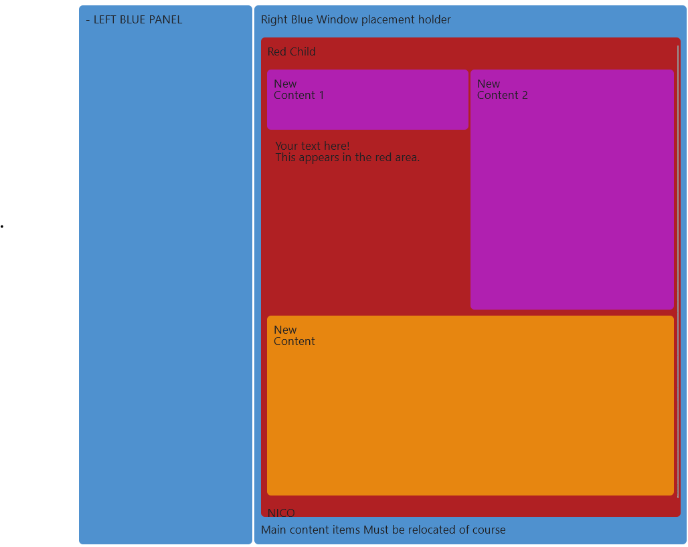

# Using CSS Elements

## Introduction

This project defines a few Custom CSS element that can be used to created a Flex box layout to organize your web client code. The customized elements are"

1. `.nje-container`
    The main container that holds together all other elements 
2. `.nje-layoutbox-flex-parent `
    A parent container elements  inside `.nje-container` that uses the flex display attribute among others,  this element is mainly used to create the structure of the box and less as an element to style the the box.
3. `.nje-contentbox-flex-child`
A child element used inside `.nje-layoutbox-flex-parent` style the box and  define the box size. This element contains **variables** that can be used to customize the element. These variables exist:

| # | Variable | Default  | Purpose |
| -- | -------------- | -------------- | ------------ |
| 1 | `--nje-grow-prio `| `1` |  *When this element has greater value then other child it will be the 1e to grow* |
| 2 | `--nje-width-perc` | `10%` | Initial *width*  |
| 3 | `--nje-width-max-perc` | `10%` | *If space is available and element has priority(see1) use this width*  |
| 4 | `--nje-font-size` | `14px` | *Tja .. size of font* |
| 5 | `--nje-textcolor` | `#202023` | .
| 6 | `--nje-bkcolor` | `#4f91cf` | .
| 7 | `--nje-height` | `auto` | ***Always use vh units.** Percentages (%) aren't supported in nested flex layouts without explicit parent heights. To prevent issues with mobile browser address bars, keep total vh below **90-95vh** (reserve 5-10vh for browser UI).* |
| 8 | `--nje-min-height` | `vh` | *Minimal Viewpoint(vh) height (see remark 7)*
| 9 | `--nje-max-heigh` | `vh` |  *Maximal Viewpoint(vh) height, if available and element has priority(see 1, and remark 7)*
| 10 | `--nje-overflow` | `auto` | *Add scroll ability if required*


## Example reference layout with nested parents

``` html

    <!--  Main container begin-->
    <div class="nje-container">

        <!-- --Blue Parent layout holder Begin -->
        <div class="nje-layoutbox-flex-parent">            

             <!-- Blue control panel contentbox -->   
            <div class="nje-contentbox-flex-child" style="--nje-width-perc: 140%; --nje-width-max-perc: 14%; ">
                - LEFT BLUE PANEL
            </div>
            
            <!-- Main Placeholder contentbox Window, blue right . begin-->
            <div class="nje-contentbox-flex-child" style="--nje-width-perc: 20%; --nje-width-max-perc: 35%;">
            Right Blue Window placement holder <br> <br>

                <!-- Nested Rede Parent layout holder  begin -->
                <div class="nje-layoutbox-flex-parent">           
                    
                    <!-- Red Placeholderr content box  begin-->   
                    <div class="nje-contentbox-flex-child" style="--nje-width-perc: 100%; --nje-width-max-perc: 100%;  --nje-bkcolor: #b02023;  --nje-height: 80vh; --nje-overflow: auto; ">
                        Red Child   <br><br>

                        <!-- Nested purple  Parent layout holder  begin -->
                        <div class="nje-layoutbox-flex-parent">  

                                <!-- Left column with purple box and text below -->
                                <!--This requires a custom  flex style because of the EXTRA block below -->
                                <!-- Without the EXTRA block, we would have used: 

                                    -<div class="nje-contentbox-flex-child" style="--nje-bkcolor: #b020b0; -nje-width-perc: 50%; --nje-width-max-perc: 50%;  --nje-min-height: 10vh; --nje-max-height: 10vh; --nje-overflow: auto;"> 
                                 instead of the next line   
                                -->
                                <div style="display: flex; flex-direction: column; gap: 3px; flex-basis: 50%; max-width: 50%;"> 
                                    <div class="nje-contentbox-flex-child" style="--nje-bkcolor: #b020b0; --nje-width-perc: 100%; --nje-width-max-perc: 100%;  --nje-min-height: 10vh; --nje-max-height: 10vh; --nje-overflow: auto;">
                                        New <br>
                                        Content 1                    
                                    </div>
                                    <!-- EXTRA: Text appears here, below purple Content 1 -->
                                    <div style="color: #202023; padding: 10px;">
                                        Your text here! <br>
                                        This appears in the red area.
                                    </div>
                                </div>
                                
                                <!-- Right column with purple box -->
                                <div class="nje-contentbox-flex-child" style="--nje-bkcolor: #b020b0; --nje-width-perc: 50%; --nje-width-max-perc: 50%; --nje-min-height: 20vh; --nje-max-height: 40vh; --nje-overflow: auto;">
                                    New <br>
                                    Content  2                   
                                </div>                            
                        </div>       <!-- End Nested purple  Parent layout holder-->

                        <!-- Orange contentbox--->
                        <div class="nje-contentbox-flex-child" style="--nje-bkcolor: #e78610; -nje-width-perc: 100%; --nje-width-max-perc:100%;  --nje-min-height: 30vh; --nje-max-height: 30vh; --nje-overflow: auto;">
                            New <br>
                            Content                     
                        </div>
                    <br>
                    NICO
                    </div> <!-- Red Placeholderr content box  END-->   
                </div><!-- Nested Rede Parent layout holder  END -->

                Main content items 
                Must be relocated of course
            </div> <!-- Main Placeholder contentbox Window, blue right . End-->

        </div><!-- --Blue Parent layout holder END -->
    </div> <!--  Main container END-->    

```

This should result into this:

