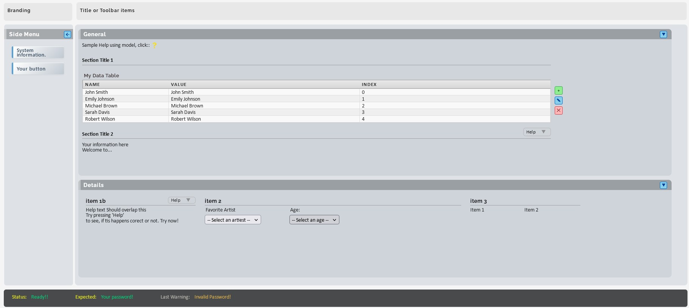

---
layout: default_c

RefPages:
  - Setup

TableCont:
  - Introduction
  - Setup

--- 
 

# .NET Development Environments  -  Docker Container

 

## Introduction

This repository contains Docker-based **development environments**for .NET projects. Currently featuring **.NET 8.0** - see the [.NET 8.0 overview](https://nicojane.github.io/NET-Dev-Template-Stack//NET-Core-8/) or jump directly to [Setup and Usage](https://nicojane.github.io/NET-Dev-Template-Stack/NET-Core-8/Howtos/setup). Support for additional .NET versions planned as needed.

### 🎯 What's Included

Each .NET development environment provides:

- **.NET SDK** with all runtimes (console, web, desktop)
- **Project templates generation scripts:** Console, Web API, MVC, Blazor, gRPC, Tests, and more
- **Cross-platform development** (Windows ↔ Linux containers)
- **Development tools** and utilities for streamlined workflows, including Visual Studio code task and launch files
- **A Workspace** folder for your project(s)

### 📁 Repository Structure

<pre class="nje-cmd-multi-line-sm">
NET-Dev-Template-Stack/
├── NET-Core-8/                         # .NET 8.0 development environment
│   ├── Howtos/                         # Documentation and guides
│   ├── Net8-Service/                   # Main service container
│   │   ├── script-templates/           # Project creation scripts
│   │   ├── Dockerfile_netcore_cont     # Container definition
│   │   └── compose_netcore_cont.yml    # Docker Compose
│   ├── Workspace/                  # Project(s) go here! 
│   └── README.md                       # .NET 8.0 specific documentation
├── assets/                             # Documentation assets
└── README.md                           # This file
</pre>

### Setup .NET 8 Core Development Environment

This refers to the .NET 8.0 development container, the only .Net development environment Container currently available. To setup refer to this page:

- **📖🚀 Enhanced Documentation .NET core 8.0**  
  View full documentation with better navigation: [Documentation Site](https://nicojane.github.io/NET-Dev-Template-Stack//NET-Core-8/)
  

### Sample

The default MVC template project in .NET 8.0 provides a complete starting point for C# development. It includes pre-built custom CSS components and demonstrates best practices for implementing them in your application.

  
 
<i><b>License</b> This file is part of: **Net-Core-Template Stack**  Copyright (c) 2025-2026 Nico Jan Eelhart.This repository is [MIT licensed](MIT-license.md) and free to use. For optional commercial support, customization, training, or long-term maintenance, see [COMMERCIAL.md](COMMERCIAL.md).</i>

  

─── ✦ ───

